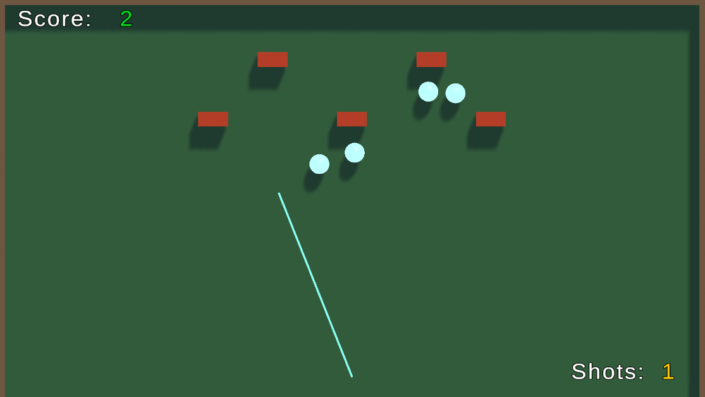

# Brick n Balls (Unity ECS Physics Test)

Brick-breaker style prototype made for a technical test assignment.

## Features

- Main Menu (UIScene): **Start Game** button

- Gameplay: shoot balls, they bounce off walls/bricks

- Bricks have HP. Each ball hit = **+1 score**

- Limited number of shots

- When the last ball falls below the bottom boundary -> Game Over popup with score + **Go Back to Menu** button

- Restartable loop: Menu -> Game -> Menu -> Game

## Tech

- Unity **6000.0.63f1**

- URP

- New Input System

- **Unity Entities + Unity Physics (ECS) used for physics only**

- UI in separate scene: `UIScene` (TMP)

- Build: IL2CPP, max stripping/optimizations

## Controls

- Mouse move left/right: aim (±75°)

- Shoot: LMB

## How to run

1. Open the project in Unity 6000.0.63f1

2. Open the main gameplay scene

3. Press Play

## Build

- Target: Windows

- IL2CPP, High Stripping enabled

## Media

